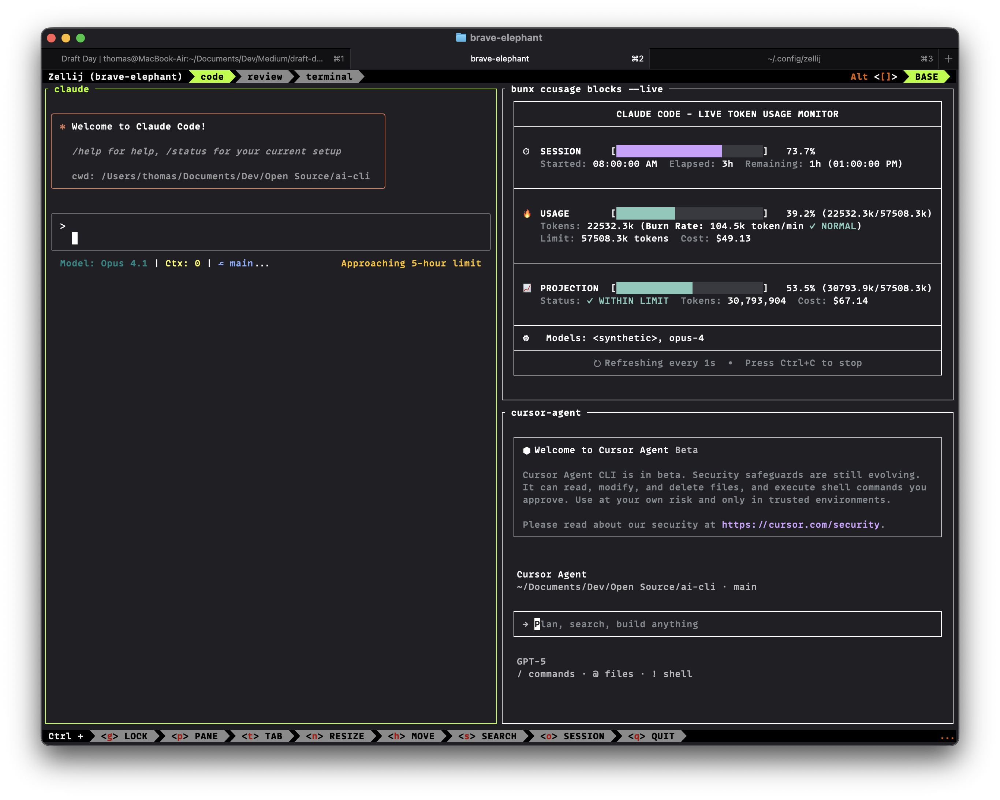

# AI-CLI - Zellij Layout for AI Coding

A Zellij layout configuration for an AI-powered coding environment with Claude, cursor-agent, and ccusage monitoring.



## Prerequisites

- [Zellij](https://zellij.dev/documentation/installation) terminal multiplexer
- Claude CLI tool
- OpenAI Codex CLI tool
- cursor-agent
- lazygit
- bunx (for ccusage blocks)

### Recommended: LazyVim
If you use `nvim` in this layout, consider installing [LazyVim](https://lazyvim.org) for an excellent out-of-the-box coding experience (LSP, formatting, treesitter, file explorer).

Quick install:
```bash
# Backup any existing Neovim config first
mv ~/.config/nvim ~/.config/nvim.bak 2>/dev/null || true

# Install LazyVim starter
git clone https://github.com/LazyVim/starter ~/.config/nvim
rm -rf ~/.config/nvim/.git

# First launch will install plugins
nvim
```

## Installation

### Quick Install

Run the setup script:

```bash
./setup.sh
```

This will:
1. Copy the `ai-coding.kdl` layout to `~/.config/zellij/layouts/`
2. Add the `ai-cli` alias to your shell configuration (`.zshrc` and `.bashrc`)

### Manual Installation

1. Copy the layout file:
```bash
mkdir -p ~/.config/zellij/layouts
cp ai-coding.kdl ~/.config/zellij/layouts/
```

2. Add alias to your shell configuration (`.zshrc` or `.bashrc`):
```bash
alias ai-cli='zellij --layout ai-coding'
```

3. Reload your shell:
```bash
source ~/.zshrc
```

## Usage

Simply run:
```bash
ai-cli
```

This will launch Zellij with the AI coding layout.

## Layout Structure

The layout includes several tabs:

### Coding Tab (default)
- Left pane (60%): Claude - Full height for AI coding assistance
- Right panes (40%): 
  - Codex - OpenAI Codex for code generation
  - lazygit - Git interface for version control

### Planning Tab
- Left pane (50%): Claude
- Right pane (50%): cursor-agent

### Review Tab
- Left pane (50%): cursor-agent
- Right pane (50%): lazygit

### Usage Tab
- Full pane: ccusage blocks (live monitoring)

### Terminal Tab
- Full pane: Regular terminal

## Customization

You can modify the `ai-coding.kdl` file to customize:
- Pane sizes
- Commands to run in each pane
- Tab names and order
- Additional tabs or panes

## Troubleshooting

If the `ai-cli` command is not found:
1. Make sure you've reloaded your shell configuration: `source ~/.zshrc`
2. Check that the alias was added correctly: `grep "ai-cli" ~/.zshrc`
3. Ensure Zellij is installed: `which zellij`

## License

MIT